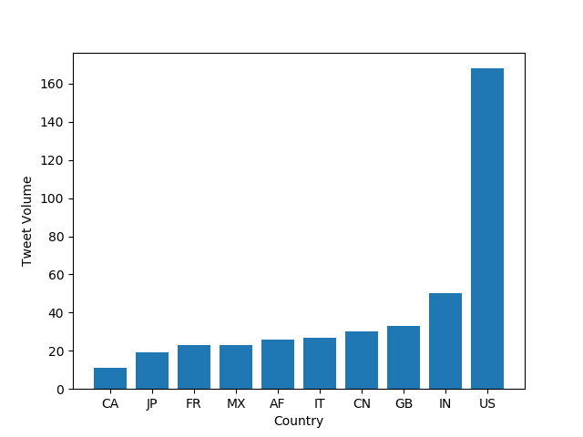

# Coronavirus twitter analysis

# De
In this project I analyzed data from a database that contains Tweets from . In particular I analyzed the data from the year 2020, when the pandemic came into full effect across the world. The lambda server's `/data/Twitter dataset` folder contains all geotagged tweets that were sent in 2020.
In total, there are about 1.1 billion tweets in this dataset.

The tweets are stored as follows.
The tweets for each day are stored in a zip file `geoTwitterYY-MM-DD.zip`,
and inside this zip file are 24 text files, one for each hour of the day.
Each text file contains a single tweet per line in JSON format.
JSON is a popular format for storing data that is closely related to python dictionaries.

Vim is able to open compressed zip files,
and I encourage you to use vim to explore the dataset.
For example, run the command
```
$ vim /data/Twitter\ dataset/geoTwitter20-01-01.zip
```
Or you can get a "pretty printed" interface with a command like
```
$ unzip -p /data/Twitter\ dataset/geoTwitter20-01-01.zip | head -n1 | python3 -m json.tool | vim -
```

**Task 2: Reduce**

The `reduce.py` file merges the outputs generated by the `map.py` file so that the combined files can be visualized.
In order to visualize this data, we need to merge it into a single file.
That is the purpose of the `reduce.py` command.
Merge the data files by running:
```
$ ./src/reduce.py --input_paths outputs/geoTwitter20-02-16.zip.lang outputs/geoTwitter20-02-17.zip.lang --output_path=reduced.lang
```
$ ./src/reduce.py --input_paths outputs/geoTwitter*.lang --output_path=reduced.lang


The format of the data files that `reduce.py` outputs is the same format as the data files that `map.py` outputs.
Therefore, we can use the same visualization code on both of them.
Now you can visualize the `reduced.lang` file with the command

## Graphic Representation of #coronavirus by country



## Graphic Representation of #coronavirus by language

## Representation of #
