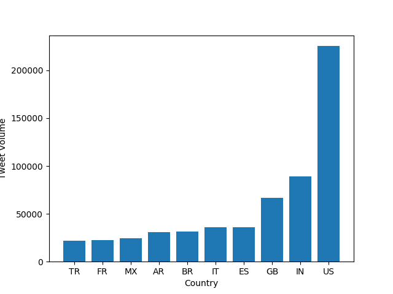
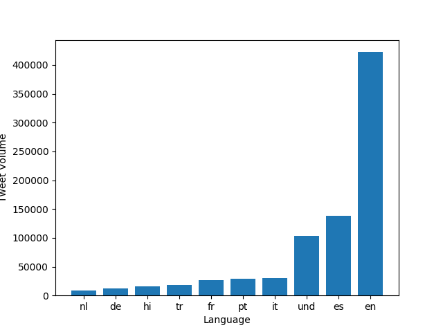

# Coronavirus twitter analysis

In this project I analyzed data from the Lambda Server that contains tweeted messages since 2013. In particular I analyzed the data from the year 2020, when the COVID-19 pandemic came into full effect across the world. In total, there are about 1.1 billion tweets in this dataset.

I used two main ways of dividing up the data; the first was by using the country (we can do this for the tweets that have geotags enabled).

Using the `map.py` file I processed a file for each day of tweets using the country and language levels. 

I then compiled this data together using the command:

```
$ ./src/reduce.py --input_paths outputs/geoTwitter20-*.country --output_path=reduced.country
``` 
This generated a file called `reduced.country` that contains data for used hashtags by country.

Then I created the graphs using the following command:

```
$ ./src/visualize.py --input_path=reduced.country --key='#coronavirus'
```
The following are the resulting graphs from running the visualization commands mentioned previously.

## Graphic Representation of #coronavirus by country



### Graphic Representation of #코로나바이러 by country


As we would expect, this hashtag was used mostly in Korea.

## Graphic Representation of #coronavirus by language



### We can also see the representation of #코로나바이러 by language


Once again, since the language of the hashtag is Korean, we would expect it to be used 
most in that situation.

## Representation of #sick and #hospital

I then used the file `alternative_reduce.py`, which takes in several keys as an input and produces a line graph representing the key through time (in this case through the year 2020).

The following command produces the plot seen directly below:

```
$ ./src/alternative_reduce.py --input_hashtags '#sick' '#hospital'
```


## Representation of #doctor and #nurse

Similarly, I generated this plot using alternative reduce. It documents the trends in the use of #doctor and #nurse through time.


